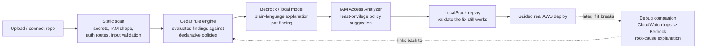

# Ship-Readiness Check — Architecture, Cost, and Competitive Landscape

Covers Option A (ship-readiness scan) with Option B (debug companion) folded in as a phase-2 layer, as you asked. One correction up front: the earlier plan had Cedar generating AWS IAM policies — that's not what Cedar does, and I've fixed the architecture below to use the right AWS service for that job.

---

## 1. One correction before anything else: Cedar ≠ IAM policy generation

Cedar (and Amazon Verified Permissions, which runs it) is an **in-application authorization language** — it decides "can this principal take this action on this resource" *inside your product*. It has nothing to do with generating AWS IAM policies for cloud resources. Claiming otherwise in a submission would be a factual error a judge could catch immediately.

**What actually generates least-privilege AWS IAM policies:** [AWS IAM Access Analyzer](https://docs.aws.amazon.com/IAM/latest/UserGuide/what-is-access-analyzer.html) — a real, GA AWS service that analyzes access activity (via CloudTrail) and generates a scoped-down policy automatically. This is the correct service for the "propose a least-privilege fix" feature.

**What Cedar is legitimately good for in this product, instead:**
1. **The rule engine itself** — encode each security check ("no wildcard IAM action", "no public S3 read/write", "secret literal present in source") as a declarative Cedar policy, evaluated against structured facts extracted from the scanned repo, instead of hardcoded if/else or regex logic scattered through the codebase. This is a genuinely uncommon design choice in this category (see §3) and a strong, honest "why AWS" story.
2. **In-app authorization** — once you have team accounts (a class of students, or a hackathon team sharing scan reports), Cedar governs who can view findings vs. who can apply a fix vs. who's admin. This is exactly Cedar's designed use case.

This keeps Cedar central to the product without misrepresenting what it does — and it's a *better* story for the "Built on AWS" criterion, because it shows you understood the service rather than bolted it on.

---

## 2. Does this satisfy the five judging criteria?

| Criterion | Fit, with the corrected architecture |
|---|---|
| **Idea & Impact** | Still narrow and nameable: one specific failure class (AI-generated code's known weak spots), not "security is important." |
| **Built on AWS** | Ship It: Bedrock, Lambda, API Gateway, DynamoDB, S3, IAM Access Analyzer, Amazon Verified Permissions/Cedar, EventBridge, Step Functions, Cognito, Amplify Hosting — all from the event's own Ship It list, plus IAM Access Analyzer (a standard AWS service, fair game even though it's not named explicitly on the hackathon page). Build It: Strands Agents SDK, SAM CLI + LocalStack, Cedar (same policies, runs anywhere), PartyRock for prompt prototyping — all from the event's own Build It list. |
| **Learning** | Real learning surface: IAM Access Analyzer, Cedar as a general policy-evaluation engine (not just app authz), Step Functions orchestration, LocalStack-based deploy validation. Log each as you hit it. |
| **Execution** | See the MVP cut in §4 — this is the part that needs the most discipline given how much surface area A+B covers. |
| **Demo Video** | Strong visual story: show a real vibe-coded repo with a real hardcoded key and a real wildcard IAM statement, scan it, watch the plain-language explanation and the least-privilege fix appear, validate locally, deploy — then (phase 2) break the deployed app and watch the debug companion trace it back to the same root cause. |

---

## 3. Competitive landscape — what exists, what's missing

| Player | What it does | What it doesn't do (relative to this idea) |
|---|---|---|
| **Gitleaks, TruffleHog, GitGuardian, detect-secrets** | Mature secret/credential scanning — regex + entropy matching, some live-verify whether a found key is still active. | Output is for engineers (rule name, file, line, entropy score) — no plain-language explanation for beginners, no AWS-specific fix or deploy validation. |
| **Snyk Code, Semgrep, SonarQube, CodeQL** | General-purpose SAST with autofix suggestions. | Not framed around *AI-generated* code's specific patterns, not paired with a guided cloud-deploy step. |
| **Amazon Q Developer** (`/review` — AWS's own flagship in this exact space) | Does scan code, suggest fixes, and give natural-language explanations, integrated across IDE/GitHub/GitLab. **Note:** Amazon CodeGuru Security was discontinued Nov 2025 in favor of this. | No evidence it generates least-privilege IAM policies (via Access Analyzer or otherwise), and no local-sandbox-validated fix testing before a real deploy. Also worth knowing: AWS has announced Q Developer's IDE plugin/subscription line is being sunset (new signups blocked mid-2026, full end-of-support 2027) in favor of a new agentic IDE called **Kiro** — worth a quick re-check closer to the event since this is a fast-moving product line, but as of now it strengthens rather than weakens the pitch: even AWS's own tool in this space doesn't close the loop this product closes. |
| **Backslash Security, Aikido Security, Corgea, Socket.dev, Cycode, Checkmarx** ("vibe-coding security" is now an established 2025–26 vendor category) | Governance/visibility for AI coding tools, AI-aware SAST, secrets + dependency scanning, framed explicitly around AI-assisted development risk. | Enterprise/governance-oriented, not AWS-native or single-cloud-specific, not built for students/beginners, no local-emulator-to-real-cloud guided pipeline. |
| **LocalStack itself** | The dominant local AWS emulator, increasingly positioned for AI-agent testing. | It's infrastructure, not a packaged "explain → fix → validate → deploy" beginner workflow — nobody has wrapped it this way for this audience. |

### The actual novelty (four concrete, defensible claims)
1. **One chained pipeline, not a point tool.** Explain → generate a real least-privilege fix via IAM Access Analyzer → validate against a real local AWS emulation via LocalStack → guided real deploy. No competitor found chains all four steps into one guided flow.
2. **Cedar as a declarative rule engine for the checks themselves**, not just an authz bolt-on — an unusual and technically legitimate use of a general-purpose policy-evaluation language that most competitors implement as hardcoded rule scripts instead.
3. **Built for the "I don't fully understand what my AI wrote" audience** specifically — plain-language, learning-first explanations. The closest things (Amazon Q Developer, Snyk, Semgrep) are built for engineers who already know what a wildcard IAM policy is; the vibe-coding-security vendors are enterprise-governance tools, not teaching tools.
4. **Closed-loop story**: when the phase-2 debug companion catches a live failure, it can trace it back to the *same* finding the static scan already flagged — "this crashed because of the exact issue we told you about on upload" — ties Option A and Option B into one coherent narrative instead of two separate features.

---

## 4. High-level architecture

### 4a. Pipeline (what the product actually does)

### 4b. Service mapping — local (Build It) vs. real AWS (Ship It)

| Stage | Local · Build It | Real AWS · Ship It |
|---|---|---|
| Agent orchestration | Strands Agents SDK + local model | Strands Agents SDK + Amazon Bedrock |
| Rule evaluation | Cedar (embedded, same policy files) | Cedar via Amazon Verified Permissions |
| Pipeline steps | SAM Local state machine | AWS Step Functions (Express, for cost — see §5) |
| API layer | SAM CLI local Lambda + API Gateway | Lambda + API Gateway |
| Findings / scan history | LocalStack DynamoDB | DynamoDB (on-demand mode) |
| Uploaded repo storage | LocalStack S3 | S3 (with a lifecycle rule — see §5) |
| Least-privilege fix | Simulated locally (no real IAM to analyze yet) | AWS IAM Access Analyzer |
| Validation-before-deploy | *This is what LocalStack already is* | Same LocalStack step, run before the real deploy |
| Auth / team accounts | Local Cognito emulation | Amazon Cognito |
| Deploy target | N/A (stays local) | Guided deploy to the user's own AWS account |
| Frontend | Local dev server | Amplify Hosting |
| Event triggers (new upload, deploy complete) | Local scheduler | EventBridge |
| Prompt prototyping | PartyRock (day one, throwaway) | — |

Note what's **not** in this table: App Runner and OpenSearch Service. Both are deliberately left out — see cost reasoning below.

---

## 5. Cost management — specific choices, not just "use the free tier"

- **No App Runner.** It's always-provisioned compute that bills even near-idle. Everything here fits Lambda + API Gateway instead, which is pure pay-per-invocation — the right call for a 4-day event on a fixed credit budget, and a defensible architecture decision to state explicitly in the write-up (judges score architecture *decisions*, not just service lists).
- **Defer OpenSearch Service.** A managed OpenSearch domain bills per node-hour whether or not it's used, and can burn through a $100–3,000 credit allocation fast over four days if left running. For the MVP, findings/history search runs on DynamoDB (a GSI on repo/date/severity is enough at hackathon scale). Only add OpenSearch — as OpenSearch **Serverless** (pay-per-OCU), not a provisioned domain — if there's real time left, and tear it down between work sessions.
- **Step Functions: Express, not Standard**, for the scan pipeline — it's a short-duration, high-frequency workflow, and Express workflows are billed per-request-and-duration rather than per-state-transition, which is cheaper at this shape of usage.
- **DynamoDB on-demand capacity**, not provisioned — avoids paying for idle throughput between demo runs.
- **S3 lifecycle rule** on uploaded repo archives — auto-expire after a few days so temporary scan uploads don't quietly accumulate storage cost.
- **Bedrock model tiering** — use a small/cheap model for the bulk of the work (classification: "is this a secret, is this an auth route") and reserve a stronger model call only for the final plain-language explanation synthesis, since classification-type calls are the highest-volume part of the pipeline.
- **Cognito and EventBridge** cost is effectively zero at this scale (Cognito's free tier alone covers far more MAUs than a hackathon demo will see).
- **Set an AWS Budget alarm on day one**, right after account setup — before any deploy — with an email/SNS alert at a low threshold (e.g., $20–30), so a misconfigured loop or an accidentally-left-running resource gets caught immediately instead of discovered Sunday night.

---

## 6. MVP cut — what has to work vs. what's additive

Given how much surface area A+B covers together, scope discipline matters more here than for a simpler idea. Suggested cut, in priority order:

1. **Core (must work):** scan → 3–4 rule categories (hardcoded secret, wildcard/missing IAM shape, missing auth check, missing input validation) → Cedar-evaluated → plain-language explanation per finding, shown in a dashboard.
2. **Stretch 1:** IAM Access Analyzer–suggested fix, one-click "apply."
3. **Stretch 2:** LocalStack validation replay of the fixed version.
4. **Stretch 3:** guided real AWS deploy.
5. **Stretch 4 (Option B folded in):** the debug companion — trace one live deployed error back to root cause, ideally linked to a finding from step 1.

Don't build secret-detection or IAM-shape-parsing from scratch — wrap/reuse known-good open patterns (the kind of checks Gitleaks and similar tools already encode) and spend the differentiated engineering time on the Cedar rule layer, the Access Analyzer integration, and the local-validate-then-deploy chain, since that combination is the actual novelty per §3.
