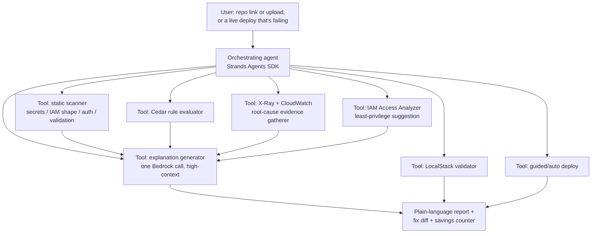

# The Combined Assistant — Mechanism, Scope Reality, and Resources

You're describing a genuine "personal assistant" framing: it sits next to the user's vibe-coding tool (Cursor, Claude Code, Bolt, Lovable, Replit Agent), catches what that tool doesn't, saves the user from burning paid AI credits on trial-and-error debugging, and also gets the thing deployed. That's a strong, specific pitch — sharper than "A and B as two features." Below is how it actually works mechanically, an honest read on what's buildable in four days vs. what belongs in the pitch as vision, and the concrete resource list.

---

## 1. The credit-saving mechanism — how it actually avoids burning the user's AI tool

This is the part worth being precise about, because "saves credits" needs a real mechanism, not just a claim.

**The problem it's solving:** when a vibe-coding tool hits an error, the normal loop is *paste error into chat → get a guess → try it → still broken → paste again → repeat*. Each round is a paid request against a metered tool (Cursor's usage-based billing past its cap, Claude usage limits, Replit Agent's per-checkpoint pricing, Lovable/v0 credit systems). A debugging session that takes 5–8 rounds of guessing costs 5–8 rounds of credits.

**How this assistant cuts that down to (ideally) one round, or zero:**

1. **Do the free/cheap work first, with no LLM call at all.** Static checks (secret patterns, IAM shape, missing auth, missing input validation) are pure code analysis — regex/AST parsing, zero model cost. A meaningful share of common issues get caught and explained here without ever touching a model.
2. **For a runtime error, gather structured evidence before guessing.** Instead of an LLM speculating from a pasted stack trace, pull the *actual* trace: **AWS X-Ray** for request-level tracing across API Gateway → Lambda → downstream calls, plus a targeted **CloudWatch Logs Insights** query scoped to the failing request's time window and trace ID. This turns "here's an error, guess why" into "here's the exact failing call, the exact upstream/downstream hop, and the exact log lines" — a structured input, not a vague one.
3. **One well-formed model call, not a guessing conversation.** With root-cause evidence already assembled, the agent makes a single Bedrock (or local model) call with the actual failing code, the actual trace, and the actual log lines — not an open-ended "what's wrong with my app." One high-context call in place of several low-context ones is the actual mechanism behind "fewer credits."
4. **Auto-apply when confidence is high and blast radius is low** (missing error handling, an obviously-wildcard IAM statement, a missing `await`) — a direct patch/PR, so the user's own AI tool never even gets invoked for that fix.
5. **Ask one clarifying question instead of guessing repeatedly**, on the rare case where evidence is ambiguous — still bounded, still not a multi-round loop.
6. **Show the savings, don't just claim them.** During the hackathon, log how many of your own test cases resolved in a single pass vs. how many rounds a naive paste-the-error-and-guess loop would plausibly take on the same bug. Report this as an observed number from your own testing ("resolved in 1 pass across our test repos" / "X issues auto-fixed with zero model calls"), not as an invented industry-wide statistic — that's honest and still a strong demo beat.

This is also the answer to "how do we analyze the project without depending on the user's vibe-coding app at all": the assistant reads the repo and the deployed app's telemetry directly (via GitHub access or a local CLI, plus X-Ray/CloudWatch once deployed) — it doesn't sit inside Cursor or Claude Code, it sits beside them, with its own independent view of the code and the running system.

---

## 2. Reality check on scope — what "complete" should mean here

You're right that judges want something that reads as a finished product solving a real problem, not five disconnected demos. But the judging language is explicit that **narrow-and-working beats broad-and-half-working** ("one feature that runs beats five that almost do"). The way to satisfy both instincts at once isn't to build everything — it's to build **one tight, closed loop really well**, and present the fuller "personal assistant" scope as the product's *trajectory*, demonstrated by the fact that the loop is architected to extend, not by having built all of it in four days.

**Tier 1 — build this, make it airtight (the actual demo):**
- Static scan (secrets, IAM shape, auth, input validation) → Cedar-evaluated → plain-language explanation. Zero-LLM-cost where possible.
- One real, deployed test app with a real bug → X-Ray/CloudWatch-traced root cause → single well-formed Bedrock call → correct fix explained.
- IAM Access Analyzer–suggested least-privilege fix, shown as a diff.
- LocalStack validation of the fix before touching real infrastructure.

**Tier 2 — build if Tier 1 lands early (still realistic for a strong team of 4):**
- Auto-apply for high-confidence, low-risk fixes, opened as a PR rather than silently pushed (keeps a human checkpoint — also a more defensible engineering story than a bot committing straight to main).
- Guided one-click real deploy via a generated SAM template, with the least-privilege role already attached.
- The "resolved in 1 pass" savings counter, populated from your own test runs.

**Tier 3 — describe as roadmap in the pitch/video, don't try to build it:**
- Fully autonomous deploy with no human checkpoint.
- IDE/VS Code extension or GitHub App living inside the user's actual workflow.
- Continuous background monitoring across every project a user owns.

Stating Tier 3 explicitly as "where this goes next" is not a weaker pitch than trying to half-build it — it directly serves the **Idea & Impact** and **Learning** criteria (you clearly understood the full shape of the problem) while Tier 1 satisfies **Execution** (it actually runs). Judges see through a submission that overpromises and glitches on stage far more easily than one that undersells scope but nails the working core.

---

## 3. Architecture: one orchestrating agent, not five separate tools

Build this as a **single Strands agent with distinct tools**, not five microservices bolted together — that's both the technically right shape (an agent choosing which tool to invoke based on the situation is exactly what an agent framework is for) and the stronger "agentic" story for judges evaluating a hackathon that's explicitly built around agent SDKs.

The agent's job is deciding *which tools to call and in what order* based on what it's looking at (a static repo vs. a live 500 error vs. a deploy request) — that decision logic is the actual product, more than any single tool is.

---

## 4. Interaction surface — keep this simple given the time budget

Don't build an IDE extension or GitHub App in four days — that's real integration work with its own auth/webhook surface and it competes for time against the core loop. The realistic surface:

- **A single web dashboard** (Amplify-hosted frontend): connect a repo (paste a GitHub URL, or upload a zip), see findings, see the fix diff, click to deploy. This is also your **Best UI** prize surface — worth real polish here specifically.
- **A CLI as a secondary, lower-effort option** for the "I'm mid-terminal-session" moment — a thin wrapper that hits the same backend API, useful for the demo video ("run it from your terminal too") without needing its own UI investment.
- Skip a chat-first interface as the primary surface — a findings dashboard with a diff view communicates "this is solving my actual problem" faster than a conversational back-and-forth would, and is easier to make look polished in three minutes of video.

---

## 5. Resources — concrete list

**AWS services (Ship It):**
- **Amazon Bedrock** — the single high-context explanation call; use a smaller model (Amazon Nova Micro/Lite or a Haiku-class model) for any bulk classification, a stronger model only for the final synthesized explanation.
- **AWS IAM Access Analyzer** — least-privilege policy generation (boto3: `accessanalyzer` client — `start_policy_generation` / `get_generated_policy`).
- **Amazon Verified Permissions (Cedar)** — the rule-evaluation engine for your own checks, and in-app authorization once there are team accounts.
- **AWS X-Ray** — request tracing across API Gateway → Lambda → downstream calls, the core mechanism for the debug-companion root-cause step.
- **Amazon CloudWatch Logs Insights** — structured, trace-scoped log queries (not raw log tailing).
- **Lambda + API Gateway** — the whole backend, kept serverless for cost reasons (see the earlier cost doc).
- **DynamoDB (on-demand)** — findings, scan history, savings-counter data.
- **S3** (with a lifecycle rule) — uploaded repo archives.
- **Step Functions (Express)** — orchestrate the scan pipeline stages.
- **EventBridge** — trigger a re-scan on new deploy or on an X-Ray error event.
- **Cognito** — team accounts.
- **Amplify Hosting** — the dashboard frontend.
- **AWS SAM** (or CDK if the team prefers code-first IaC) — generates the deploy template the guided-deploy tool actually runs; SAM is the better fit here since it's also what powers the Build It local-validation path, so the same template does double duty.

**Open-source / Build It stack:**
- **Strands Agents SDK** — the orchestrating agent, both locally (against an open model) and against Bedrock.
- **SAM CLI + LocalStack** — local emulation, and specifically the pre-deploy validation step in the pipeline itself.
- **Cedar** (embedded) — identical policy files run locally and in AWS.
- **PartyRock** — throwaway prompt prototyping on day one before wiring the real explanation prompt into the agent.
- **Corretto / Firecracker** — underlying LocalStack runtime; worth a line in the learning writeup, not something you build against directly.

**Don't rebuild, wrap instead:**
- Known-good open detectors for the static-scan layer — the kind of pattern sets **Gitleaks** and **detect-secrets** already encode for secrets, plus simple AST checks for IAM shape/auth/validation. Reinventing secret-detection from scratch wastes hackathon time on a solved problem; the differentiated engineering effort belongs in the Cedar rule layer, the Access Analyzer integration, and the X-Ray-driven root-cause step.

**Repo/deploy access:**
- **GitHub REST API** (via PyGithub or Octokit) — read a connected repo, and open a PR for an auto-applied fix rather than pushing directly.
- **boto3 (AWS SDK for Python)** — every AWS-side call listed above.

**Reference, not a dependency:**
- **Amazon Q Developer's `/review`** — AWS's own closest product in this space; worth having one team member actually try it before the event, specifically to see where it stops short of least-privilege generation and local-validate-before-deploy, since that gap is your differentiation story (see the earlier competitive-landscape doc). Note its IDE line is being succeeded by a newer AWS tool (Kiro) — worth a quick recheck of current state close to the event, since this is moving fast.

---

## 6. What this changes about team roles and the MVP timeline

The role split from the earlier plan still holds (Agent & AI / Platform & Infra / Data & Access / Experience & Demo) — this just sharpens what "Agent & AI" owns: the orchestration logic deciding which tool to call when, not just prompt-writing. The one addition: whoever owns Platform & Infra should specifically own **X-Ray instrumentation** on the deployed test app early (Friday), since the debug-companion tool has nothing to trace without it — this is the one piece that has to exist *before* you can demo Tier 1's second half, so it shouldn't be left until Saturday.
