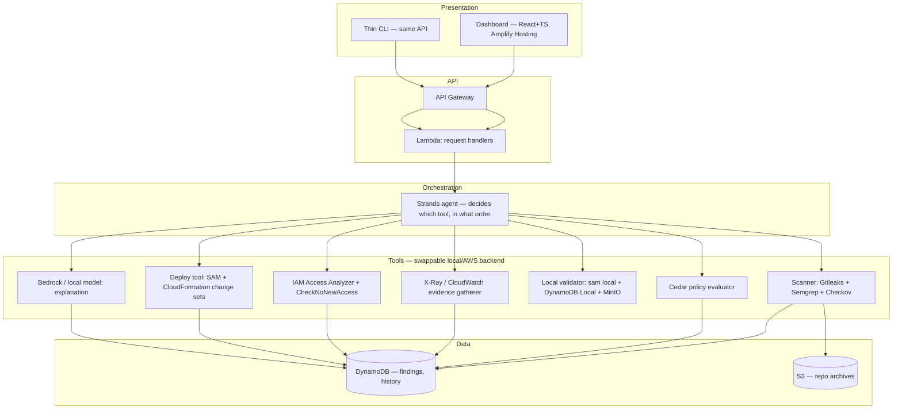
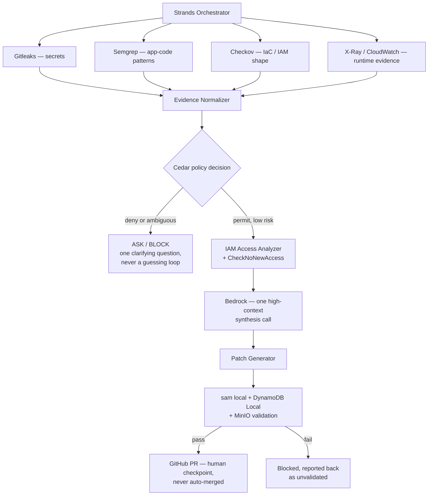

# Complete Technical Reference

Single consolidated reference before implementation starts — project description, every feature mapped to its services, full architecture, cost management, the technical build phases, and the verified GitHub integrations. Supersedes nothing already saved in `C:\SideQuest\First_Commit`; this is the one-stop version of all of it.

---

## 1. Project Overview

### 1.1 Problem

Vibe coders (building primarily by prompting AI tools — Cursor, Claude Code, Bolt, Lovable, Replit Agent) and CS students building portfolio/hackathon projects share one gap: AI has made **writing** code nearly free, but **shipping it safely, securing it, and being able to explain it** hasn't gotten any easier — and AI assistance arguably widens that gap, since it quietly does the parts a builder would normally learn by doing themselves. Concretely: hardcoded secrets, wildcard IAM permissions, missing auth checks, and missing input validation are the recurring, nameable failure modes in AI-generated and student code, and when something does break, the normal recovery loop is *paste error into the AI tool → get a guess → try it → still broken → repeat* — a loop that costs real money against metered AI-tool credits (Cursor's usage billing, Replit Agent's per-checkpoint pricing, Claude/Copilot usage limits).

### 1.2 Solution

An assistant that sits beside the user's AI coding tool, not inside it:

1. **Scans** a repo for the specific failure modes above, explaining each in plain language.
2. **Proposes a real least-privilege fix** (not a guess) for IAM findings, and **blocks** any proposed fix that would expand access rather than narrow it.
3. **Validates** the fix locally before it's allowed near real infrastructure.
4. **Deploys** it, guided, with a human checkpoint before anything touches production.
5. **Traces** a live runtime error back to root cause using real evidence (distributed tracing + scoped logs), not a guess — and reuses the original scan findings when the two are related.
6. Does all of the above with **cheap deterministic checks and structured evidence gathered first**, so the model gets called once, with full context — not repeatedly, the way a manual debugging loop would.

### 1.3 Track strategy

Not a parallel split — a **sequence**. Build and fully validate against a local, zero-AWS-account stack first (fast iteration, free), then cut over the same codebase to real AWS once the logic is proven. Submission target is **Ship It** (bigger prize, only track scoring architecture/cost decisions); the local path stays alive the whole time as both the dev environment and the Build It fallback if a real deploy breaks near the deadline.

### 1.4 Novelty, stated plainly

No competitor found (see the verified competitive-landscape research already on file) chains **explain → real least-privilege fix → local validation → guided deploy → traced root-cause on failure** into one governed flow. The governance layer is the actual differentiator: a generic coding agent says *"I think you should change this."* This product says *"I think this should change → policy evaluation → but I'm not allowed to execute it automatically."* That's a materially different, more defensible claim than "AI code review."

---

## 2. Features, each mapped to its services

| # | Feature | What it does | AWS service(s) | OSS / local equivalent |
|---|---|---|---|---|
| 1 | Repo ingestion | Accepts a Git URL or zip upload, normalizes into a file tree, enforces size/count/timeout limits before analysis | S3 (storage) | MinIO (local S3-compatible) |
| 2 | Secret detection | Finds hardcoded credentials | — | **Gitleaks** (wrapped, not reimplemented) |
| 3 | Application-pattern scanning | Missing auth checks, unsafe subprocess calls, missing input validation | — | **Semgrep** (custom rules) |
| 4 | IaC / IAM-shape scanning | Wildcard `Action`/`Resource` in SAM/CloudFormation templates | — | **Checkov** (purpose-built IaC scanner, complements Semgrep) |
| 5 | Evidence normalization | Merges findings from #2–4 into one structured schema | Lambda | Python, local |
| 6 | Policy decision | Evaluates each finding: permit / deny / needs-human-approval | Amazon Verified Permissions (or embedded Cedar as fallback) | **Cedar** (embedded, runs anywhere) |
| 7 | Plain-language explanation | One high-context model call over the structured evidence, never raw code | **Amazon Bedrock** (model-tiered: cheap model for classification, stronger model for final synthesis) | Local model via Strands adapter |
| 8 | Least-privilege remediation | Generates a scoped-down IAM policy from real access activity | **AWS IAM Access Analyzer** (`start_policy_generation`/`get_generated_policy`) | N/A — needs a real AWS role to analyze |
| 9 | Access-expansion guard | Confirms a proposed fix doesn't *increase* access vs. the current policy | **IAM Access Analyzer `CheckNoNewAccess` API** | N/A |
| 10 | Local validation | Deploys the fix locally, runs a smoke test, before it's allowed near real infra | — | **`sam local`** (Lambda/API GW) + **Amazon DynamoDB Local** + **MinIO** |
| 11 | Guided deploy | Applies the validated fix to real AWS via a reviewable, rollback-safe change | AWS SAM, **CloudFormation change sets** | `sam deploy` (guided) |
| 12 | Debug companion | Traces a live error back to root cause using real evidence | **AWS X-Ray** (request tracing) + **CloudWatch Logs Insights** (scoped, trace-ID-filtered query) | Fixture trace data (local dev only) |
| 13 | Auto-apply | Opens a PR with the fix for low-risk, high-confidence findings — never a direct commit | — | GitHub REST API (PyGithub), token scoped to PR-write only |
| 14 | Team accounts / RBAC | Who can view findings vs. apply a fix vs. trigger a deploy | **Amazon Cognito** (auth) + Cedar (authorization) | Local Cognito emulation |
| 15 | Orchestration | Decides which tool to invoke, in what order, with durable retry | **Strands Agents SDK** (decision logic) + **AWS Step Functions (Express)** (durable execution) + **EventBridge** (triggers) | Strands + local model, SAM Local state machine |
| 16 | Findings & scan history | Structured storage, idempotent by content hash | **DynamoDB (on-demand)** | DynamoDB Local |
| 17 | Dashboard | Connect/upload, findings, fix diff, deploy button, trace view | **Amplify Hosting** (React + TypeScript) | Local dev server |
| 18 | Budget safety | Alarms before any resource is provisioned | **AWS Budgets** | N/A |
| 19 | Prompt prototyping | Throwaway exploration of the explanation prompt before wiring it into code | **PartyRock** | N/A |
| 20 | Product self-observability | Structured logs + one CloudWatch dashboard for the system's *own* health (separate from #12, which monitors the *user's* app) | CloudWatch | N/A |

---

## 3. Architecture

### 3.1 Layered view



### 3.2 Decision pipeline (the actual product logic)



### 3.3 Local/AWS adapter (the track-hedge mechanism)

One `MODE=local|aws` variable, one interface, two implementations behind Layer 4 only — nothing above the tool layer changes between tracks. Local mode uses Strands + a local model, `sam local`, DynamoDB Local, MinIO, and embedded Cedar. AWS mode uses Strands + Bedrock, real Lambda/API Gateway, DynamoDB, S3, and Amazon Verified Permissions (or embedded Cedar as a scope-reduction fallback if AVP provisioning costs too much time).

### 3.4 Example Cedar policies (the governance layer, concretely)

```
// Low-risk, high-confidence, non-production → auto-fix allowed
permit(
  principal,
  action == Action::"applyFix",
  resource
) when {
  resource.environment == "development" &&
  resource.risk == "low" &&
  resource.confidence >= 0.9
};

// Any IAM policy modification in production → human approval required
forbid(
  principal,
  action == Action::"applyFix",
  resource
) when {
  resource.environment == "production" &&
  resource.changeType == "IAMPolicyModification"
} unless {
  resource.humanApproved == true
};
```

This is the mechanism behind the "ASK/BLOCK" branch in §3.2 — the decision is declarative and auditable, not buried in application code.

---

## 4. Cost management — decisions, not defaults

| Decision | Reasoning |
|---|---|
| Lambda + API Gateway, **no App Runner** | App Runner is always-provisioned and bills near-idle; Lambda is pure pay-per-invocation |
| DynamoDB **on-demand** capacity | No idle-throughput cost between demo runs |
| S3 **lifecycle rule** on uploaded repo archives | Auto-expire after a few days so temporary uploads don't accumulate storage cost |
| Step Functions **Express**, not Standard | Short-duration, high-frequency workflow — Express is billed per-request-and-duration, cheaper at this shape |
| Bedrock **model tiering** | Cheap model for bulk classification calls, stronger model reserved for the one final explanation synthesis |
| **Defer managed/provisioned OpenSearch entirely** | Bills per node-hour even idle — a real risk to a fixed multi-day credit budget. DynamoDB GSIs cover MVP search; OpenSearch Serverless only as a stretch, torn down between sessions |
| Secrets in **SSM Parameter Store**, not Secrets Manager | Free tier vs. per-secret monthly charge |
| **AWS Budgets alarm set immediately** after account creation, before any other resource exists | Catches a runaway resource or misconfigured loop before it's discovered as a surprise |
| **LocalStack replaced** with `sam local` + DynamoDB Local + MinIO | Not just cost — LocalStack's OSS repo is archived (confirmed, Mar 23 2026) and consolidated into a commercial product; three single-purpose, verifiably-free tools are both cheaper and a cleaner fit for Build It's "no account" rule |
| Findings **cached by content hash** | Re-scanning unchanged code costs zero additional model calls |
| Per-Lambda **least-privilege IAM roles**, not one shared execution role | Not a cost decision, but the same discipline the product enforces on its own users — a strong architecture-scoring point for Ship It |

---

## 5. Data model

**Entities:** `Scan` (repo ref, status, timestamps), `Finding` (type, severity, location, evidence, explanation, fix status), `Policy` (the Cedar rule behind a decision), `DeploymentAttempt` (target, status, rollback state).

**DynamoDB:** single table where access patterns justify it — `scan_id` as partition key, `finding_id`/timestamp as sort key. Every write keyed off a **content hash** (repo commit SHA + file hash), not an auto-incrementing ID, so a re-run of unchanged content never creates duplicate findings — idempotency by construction, not cleanup logic bolted on after.

**Concurrency:** conditional writes (`ConditionExpression` on the deterministic key) make pipeline retries safe without extra dedup logic.

**Multi-tenancy:** a user's scans/findings are only ever queryable via their own partition key — verified with an active test that tries a cross-tenant read and confirms it's rejected, not assumed safe because the query "shouldn't" allow it.

---

## 6. End-to-end workflow

1. User connects a repo (GitHub URL) or uploads a zip.
2. Orchestrator kicks off Gitleaks + Semgrep + Checkov in parallel; results merge into normalized evidence.
3. Cedar evaluates each finding: permit (low risk) / deny / needs-human-approval.
4. For permitted findings involving IAM: Access Analyzer generates a scoped policy; `CheckNoNewAccess` confirms it doesn't expand access.
5. One Bedrock call synthesizes the plain-language explanation + fix rationale from the structured evidence gathered in steps 2–4 — never raw code, never a multi-turn guess.
6. Fix is validated locally (`sam local` + DynamoDB Local + MinIO): deploy succeeds, smoke test passes.
7. If validated: opens a GitHub PR (never auto-merged) or surfaces a guided real-deploy button (never auto-deployed) — a human confirms either way.
8. Once deployed and live: X-Ray traces every request; on an error, the debug-companion tool pulls the failing hop + a trace-scoped CloudWatch Logs Insights query, and — if it matches an earlier static finding — explicitly says so ("this crashed because of the exact issue flagged on upload").
9. Every step's outcome (model calls made, static-only resolutions, auto-fix rate) is logged for the evaluation harness in §9.

---

## 7. Measuring the "saves credits" claim — don't just assert it

Turn this into evidence, not marketing copy, using the AWS agent-evaluation sample repo (see §10) or a hand-rolled counter if that framework proves too immature to depend on:

| Scenario | Naive trial-and-error loop | This assistant |
|---|---|---|
| Missing environment variable | ~3 model interactions (paste error, guess, retry) | **0 model calls** — resolved by a static detector alone |
| Lambda → DynamoDB permission error | ~5 prompt/response cycles | **1 evidence-gathering pass** (X-Ray/CloudWatch) + **1 synthesis call** |

Track across your own test fixtures: model calls avoided, average diagnosis passes, time-to-diagnosis, auto-fix rate, false-positive rate. This is real experimental evidence for the submission, not a claim — and it's exactly the kind of thing judges reward under both **Idea & Impact** and **Learning**.

---

## 8. Security & governance design

- Scanner **never executes** scanned code — static analysis only, since the input is untrusted by definition.
- Hard limits before analysis starts: max file count, max file size, max decompressed size, wall-clock timeout — fail with a clear "too large" result, not a silent Lambda timeout.
- Scan worker runs with the narrowest IAM role and network access it can function with.
- Auto-apply proposes (a PR); it never deploys to real infrastructure without a human checkpoint — Cedar's `humanApproved` condition in §3.4 is the enforcement point, not a UI convention.
- GitHub integration token scoped to exactly "open a PR," nothing more — the same least-privilege discipline the product enforces on AWS IAM applies to its own credentials.
- CloudFormation change sets for every real deploy — reviewable before applied, with an automatic rollback target if something fails partway.
- X-Ray sampling defaults to **not** tracing every request — set an explicit 100% sampling rule on the target/demo app, or the debug companion will intermittently have "no trace found" for a real, reproducible error.

---

## 9. Implementation phases (technical build sequence)

Pure construction order — build each phase's exit criteria before moving to the next.

| Phase | Objective | Key complex-problem it must survive |
|---|---|---|
| 1. Foundation | `infra/template.yaml` parameterized for local/AWS from day one; one IAM role per Lambda from the start | Environment-parity drift — decide now which local paths are emulated vs. mocked |
| 2. Domain model & data layer | Entities, DynamoDB schema, content-hash idempotency | Concurrent writes on pipeline retries |
| 3. Ingestion & static analysis | Wrap Gitleaks/Semgrep/Checkov, normalize output | Untrusted input: never execute scanned code, hard resource limits, sandboxed scan worker |
| 4. Policy engine | Cedar policies per finding type, versioned and testable | Policy conflict/precedence rules must be explicit, not accidental |
| 5. AI reasoning layer | One structured, evidence-first prompt; model tiering | Hallucinated/malformed output — enforce schema, validate, retry once, then human-review; cache by content hash |
| 6. Orchestration | Strands agent + Step Functions, idempotent states | Partial failure — surface partial results clearly labeled, don't discard on one bad detector |
| 7. Least-privilege remediation | Access Analyzer + `CheckNoNewAccess` | Cold-start: a fresh role has no activity history — fall back to a static, rule-derived estimate and **label which method produced which result** |
| 8. Local validation | `sam local` + DynamoDB Local + MinIO replay | Local validation is necessary but not sufficient — IAM enforcement is looser locally than in prod; real deploy still needs its own smoke test |
| 9. Deployment automation | CloudFormation change sets, human checkpoint | Partial deploy failure — rely on CloudFormation's own rollback, surface the outcome clearly |
| 10. Observability / debug companion | X-Ray + CloudWatch Logs Insights, one synthesis call | X-Ray sampling — force 100% on the target app or tracing is intermittent |
| 11. API & frontend | Async long-running ops (scan/deploy), polling | Don't block an HTTP request on a 30-second operation — return an execution ID immediately |
| 12. Security & multi-tenancy | Parameter Store secrets, Cedar RBAC, cross-tenant isolation | Verify isolation with an active adversarial test, not an assumption |
| 13. Testing & QA | Unit (per detector/policy/tool) + integration (fixture-driven) + one real e2e + a chaos pass | Inject a failure at every stage and confirm graceful degradation, not just happy-path success |
| 14. Hardening & packaging | Fresh, unfamiliar test repo; full smoke test; docs reflect what was actually built | Overfitting to your own test fixtures — always validate against something the system hasn't seen |

*(Full per-phase task breakdown with owners/services/exit-criteria tables already lives in `first-commit-execution-runbook.md` and `first-commit-solo-build-sequence.md` in the same folder — this table is the condensed index.)*

---

## 10. GitHub repository integrations — verified

All fetched directly against GitHub before inclusion; none hallucinated.

### Adopt directly (mature, low risk)
| Repo | Role |
|---|---|
| [strands-agents/samples](https://github.com/strands-agents/samples) | Orchestration foundation — agent setup, tool patterns, deployment patterns |
| [cedar-policy/cedar](https://github.com/cedar-policy/cedar) | The policy engine itself |
| [gitleaks/gitleaks](https://github.com/gitleaks/gitleaks) | Secret detection |
| [semgrep/semgrep](https://github.com/semgrep/semgrep) | App-code pattern scanning |
| [bridgecrewio/checkov](https://github.com/bridgecrewio/checkov) | IaC/IAM-shape scanning, complements Semgrep |
| [aws/aws-sam-cli](https://github.com/aws/aws-sam-cli) | Local validation + real deploy, both tracks |

### Adopt for a specific feature (real, official AWS, smaller but targeted)
| Repo | Role |
|---|---|
| [aws-iam-access-analyzer-samples](https://github.com/aws-samples/aws-iam-access-analyzer-samples) | ValidatePolicy / Access Preview patterns |
| [automated-iam-access-analyzer](https://github.com/aws-samples/automated-iam-access-analyzer) | Step-Functions-orchestrated policy-refinement reference |
| [iam-access-analyzer-custom-policy-check-samples](https://github.com/aws-samples/iam-access-analyzer-custom-policy-check-samples) | `CheckNoNewAccess` — the access-expansion guard, feature #9 above |

### Study only — real but thin (0–2 stars, single-digit commits); read for the pattern, don't hard-depend on the code
| Repo | What to take from it |
|---|---|
| [sample-aws-agentic-ai-workshop](https://github.com/aws-samples/sample-aws-agentic-ai-workshop) | Local → AgentCore deployment journey shape |
| [sample-evaluating-agents-on-aws-with-strands-and-agentcore](https://github.com/aws-samples/sample-evaluating-agents-on-aws-with-strands-and-agentcore) | Layered eval framework for §7's measurement — time-box a 30-min spike before committing to it; keep a hand-rolled counter as fallback |
| [sample-external-agents-telemetry-on-agentcore-observability](https://github.com/aws-samples/sample-external-agents-telemetry-on-agentcore-observability) | OTel → CloudWatch wiring pattern |
| [sample-agent-ready-api-code](https://github.com/aws-samples/sample-agent-ready-api-code) | The confirmation/rate-limit/logging hooks pattern — maps to the human-checkpoint design in §8 |

### Optional
| Repo | When to add it |
|---|---|
| [Yelp/detect-secrets](https://github.com/Yelp/detect-secrets) | Only if baseline ("block new secrets, don't dump historical ones") behavior is genuinely needed — don't run two secret scanners just to inflate the architecture |

### Not GitHub repos, but part of the verified stack
- **Amazon DynamoDB Local** (official AWS Docker image) — local DynamoDB, no account needed
- **MinIO** — S3-compatible local object storage, AGPLv3 (irrelevant for internal dev/test use)

---

## 11. Repository structure

```
project/
├── .github/workflows/      # CI: lint, unit tests, SAM validate
├── infra/template.yaml     # single SAM template, parameterized by MODE
├── agent/
│   ├── tools/               # scanner.py, cedar_eval.py, xray_trace.py,
│   │                        # access_analyzer.py, local_validate.py, deploy.py, explain.py
│   ├── adapters/            # local_adapter.py / aws_adapter.py
│   └── tests/
├── api/                     # thin Lambda handlers, delegate to agent/
├── policies/                # Cedar policy files
├── web/                     # React + TypeScript dashboard
├── fixtures/
│   ├── golden-repo/         # planted-issue fixture: 1 secret, 1 wildcard IAM,
│   │                        # 1 missing auth, 1 missing validation
│   └── hostile-repo/        # adversarial fixture: huge file, binary, deep nesting
├── docs/
│   ├── ADRs/                 # short, dated architecture decisions
│   ├── LEARNINGS.md
│   └── architecture.md
├── .env.example
└── README.md
```

---

## 12. Engineering standards

- **Languages:** Python 3.12 (agent/API — Strands + boto3 native), TypeScript + React (dashboard).
- **Lint/format:** Ruff + Black (Python), ESLint + Prettier (TS).
- **Tests:** Pytest, Vitest — unit per detector/policy/tool, plus the fixture-driven integration suite.
- **Git:** trunk-based, short-lived feature branches per tool, conventional commits, real PR review even solo (a 5-minute self-review before merge catches integration breaks).
- **Secrets:** never in code or `.env` committed — SSM Parameter Store.
- **IAM:** one scoped role per Lambda, written explicitly in the template — never a shared or default-managed policy.
- **Observability:** structured (JSON) logs, X-Ray from the first real deploy, one CloudWatch dashboard for the system's own health.
- **Decisions get written down:** a 10-line ADR for each real architecture call (SAM over CDK, Express over Standard Step Functions, Parameter Store over Secrets Manager, Cedar-as-rule-engine not IAM, `sam local`+DynamoDB Local+MinIO over LocalStack) — this directly *is* the Ship It "architecture decisions" scoring criterion.

---

## 13. Definition of Done

- [ ] Full pipeline (§6) runs cleanly on real AWS, 3x in a row, unattended
- [ ] Own repo scanned with own scanner — result recorded, not hidden
- [ ] `docs/architecture.md` and ADRs reflect what was actually built
- [ ] Evaluation numbers from §7 collected from real test runs, not invented
- [ ] `LEARNINGS.md` has dated entries from across the build, not written retroactively
- [ ] Cross-tenant isolation test passes
- [ ] X-Ray sampling explicitly set to 100% on the demo target
- [ ] AWS Budgets spend checked against expectations
- [ ] 3-minute demo video, public URL, GitHub repo, Builder Center blog post — all linked in the submission
