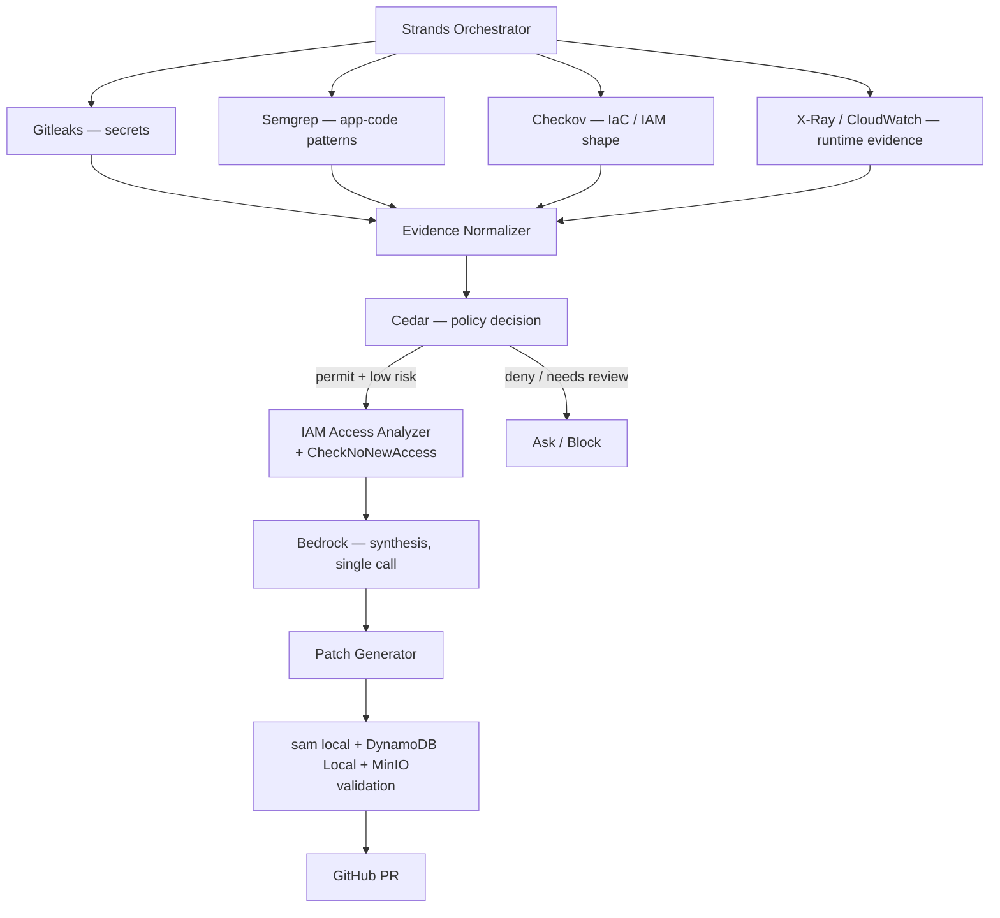

# Repo Verification & Final Dependency Stack

I fetched every repo in your list directly from GitHub rather than trusting the descriptions as given — a few of the AWS sample repos have names specific enough that they're exactly the kind of thing a research tool can hallucinate. All 14 are real. One of them has a serious, verified problem you were right to flag, and I found a clean fix for it plus two additions worth considering.

---

## 1. Verdict, repo by repo

### Adopt directly — mature, low risk

| Repo | Verified stats | Verdict |
|---|---|---|
| [strands-agents/samples](https://github.com/strands-agents/samples) | 840★, Apache-2.0, active | **Yes** — exactly as described: 02-deploy (Lambda/Fargate/AgentCore), 05-technical-use-cases (agentic RAG), 06-evaluate, 07-ux-demos all confirmed present. Correct foundation. |
| [cedar-policy/cedar](https://github.com/cedar-policy/cedar) | 1.7k★, Apache-2.0, 1,508 commits | **Yes** — official, actively developed. |
| [gitleaks/gitleaks](https://github.com/gitleaks/gitleaks) | 29.2k★, MIT | **Yes** — mature. Note: maintainer states it's "feature complete… future releases will be security patches only." That's a feature, not a risk, for a hackathon dependency — it means the API you build against won't shift under you. |
| [semgrep/semgrep](https://github.com/semgrep/semgrep) | 16.5k★, LGPL-2.1, 10k+ commits | **Yes** — very active. One nuance worth a 5-minute check: Semgrep's *engine* is LGPL-2.1, but some of Semgrep's own pre-built rule packs carry separate licensing. Writing your own custom rules (which is your plan) is unaffected — just don't assume every rule in their public registry is freely redistributable if you bundle rules into your own repo. |
| [aws/aws-sam-cli](https://github.com/aws/aws-sam-cli) | 6.7k★, Apache-2.0, latest release Jul 2026 | **Yes** — actively maintained, current. |
| [Yelp/detect-secrets](https://github.com/Yelp/detect-secrets) | 4.6k★, Apache-2.0 | **Yes**, as your own fallback/optional pick — agreed, don't run it alongside Gitleaks by default; the baseline concept is genuinely useful if you want "block only *new* secrets" behavior later. |

### Adopt for the specific feature — real, official AWS, smaller but targeted

| Repo | Verified stats | Verdict |
|---|---|---|
| [aws-iam-access-analyzer-samples](https://github.com/aws-samples/aws-iam-access-analyzer-samples) | 25★, MIT-0, 42 commits | **Yes** — confirmed ValidatePolicy, Access Preview, and CloudFormation policy-validation examples all present. |
| [automated-iam-access-analyzer](https://github.com/aws-samples/automated-iam-access-analyzer) | 25★, Apache-2.0 | **Yes** — confirmed CloudTrail-driven, Step-Functions-orchestrated continuous policy refinement. Good reference for your Step Functions pipeline shape. |
| [iam-access-analyzer-custom-policy-check-samples](https://github.com/aws-samples/iam-access-analyzer-custom-policy-check-samples) | 24★, MIT-0 | **Yes, and this is the standout find in your list.** `CheckNoNewAccess` — comparing a proposed policy against the existing one and flagging *expanded* access specifically — is a sharper mechanism than what was in the earlier architecture docs (which only covered generating a scoped-down policy). Add this: it's the piece that lets Cedar say "this fix would *increase* access, block it" rather than only reasoning about the absolute shape of a policy. Fold this into Phase 7 of the build sequence. |

### Real, but genuinely thin — study, don't hard-depend on

| Repo | Verified stats | Verdict |
|---|---|---|
| [sample-aws-agentic-ai-workshop](https://github.com/aws-samples/sample-aws-agentic-ai-workshop) | **2★**, MIT-0, 22 commits | Real, structurally matches your local→cloud journey (confirmed 8 chapters, memory, AgentCore deployment, OTel). Low star count means small blast radius if something in it is subtly wrong — read it for the architecture, as you already planned. Don't import its code as a dependency. |
| [sample-evaluating-agents-on-aws-with-strands-and-agentcore](https://github.com/aws-samples/sample-evaluating-agents-on-aws-with-strands-and-agentcore) | **0★**, MIT-0, 4 commits | Real, and well-matched to your credit-saving evaluation claim (confirmed 3-layer framework + a no-AWS quickstart under 60 seconds). But 0 stars and 4 commits is about as thin as a repo gets — it may be undocumented in places or have rough edges. **Time-box a 30-minute spike on it Thursday** before committing to it for the evaluation harness; have a fallback ready (a hand-rolled counter logging "model calls made per scenario" — you don't strictly need their framework to produce the number, just a consistent measurement). |
| [sample-external-agents-telemetry-on-agentcore-observability](https://github.com/aws-samples/sample-external-agents-telemetry-on-agentcore-observability) | **0★**, 4 commits | Real, confirmed OTel→CloudWatch wiring. Read for the pattern, don't depend on the code directly. |
| [sample-agent-ready-api-code](https://github.com/aws-samples/sample-agent-ready-api-code) | **0★**, 2 commits | Real, confirmed hooks pattern (confirmation/rate-limit/logging before tool execution) — this maps directly onto the "human-in-the-loop apply" design already in the earlier docs. Borrow the *pattern* conceptually; this is 2 commits old, not something to import as a library. |

---

## 2. The critical finding: LocalStack is archived — confirmed, and it matters

**Verified directly on GitHub:** `localstack/localstack` carries the banner *"This repository was archived by the owner on Mar 23, 2026. It is now read-only."* 65.1k stars, 7,855 commits — this was a real, heavily-used project, now frozen. Development consolidated into a commercial product called "LocalStack for AWS" with a free "Hobby" tier and paid plans.

**Why this is more than a licensing footnote for you specifically:** the hackathon's own Build It track requirement is explicit — *"No account, no card, no bill."* If the current LocalStack Hobby tier requires a sign-up or account to run (common for consolidated commercial products, even free ones), depending on it could put your Build It eligibility at risk on a technicality. **Verify this specific point before Thursday** — check whether `localstack start` still works fully offline/unauthenticated under the current product, or whether it now gates behind a login.

**Your own instinct — SAM CLI as the sufficient core path, LocalStack as optional — is correct, and I'd go further:**

`sam local start-api` / `sam local invoke` run Lambda and API Gateway locally via Docker with **no LocalStack and no AWS account at all** — that's most of your local validation story already covered without touching the archived project. For the two services SAM local doesn't emulate that you actually need (DynamoDB, S3), there are narrower, genuinely account-free official/open alternatives:

| Service | Instead of LocalStack, use | Why |
|---|---|---|
| Lambda + API Gateway | `sam local` (Docker) | Already zero-account, no LocalStack needed at all |
| DynamoDB | **[Amazon DynamoDB Local](https://docs.aws.amazon.com/amazondynamodb/latest/developerguide/DynamoDBLocal.html)** (`amazon/dynamodb-local` on Docker Hub) | Official AWS-provided, downloadable/Docker, no account or credentials required — confirmed via AWS's own docs pages. Purpose-built for exactly this, not a byproduct of a general emulator. |
| S3 | **[MinIO](https://github.com/minio/minio)** | S3-API-compatible object storage, runs fully locally, no AWS account. Note: AGPLv3-licensed — irrelevant for internal dev/test use in a hackathon, only matters if you were redistributing MinIO's own source inside a product you ship, which you're not. |
| Step Functions / EventBridge | SAM's local testing is thinner here — mock these behind your adapter interface for local dev, use the real services once you cut over to Ship It (which was already the plan) | Avoids depending on LocalStack's uncertain coverage for the less-critical local path |

This is a **stronger** story for your submission than depending on LocalStack, not a weaker one: it's more precisely "no account, no card, no bill" (three single-purpose, verifiably free tools instead of one consolidated product whose free-tier terms just changed), and it removes a dependency that's mid-transition and less predictable right now.

---

## 3. One addition worth considering: Checkov, alongside Semgrep

Your plan uses Semgrep for the general "IaC parser" node in the pipeline diagram (wildcard IAM, missing timeouts, etc.). [bridgecrewio/checkov](https://github.com/bridgecrewio/checkov) is a purpose-built infrastructure-as-code scanner (CloudFormation/SAM/Terraform) with a large existing policy library specifically for misconfigurations like overly-permissive IAM — confirmed real, actively maintained, commonly cited with 1,000+ built-in policies.

**Recommendation:** don't replace Semgrep with it — Semgrep is still the right tool for general application-code patterns (missing auth checks, unsafe subprocess calls). But for the specific "does this SAM template/CloudFormation have a wildcard IAM statement" check, Checkov's built-in IaC rule set is more purpose-fit than hand-writing that rule in Semgrep from scratch, and it's less work than it sounds like since it's a drop-in CLI call against your template file. Worth a 15-minute trial during Phase 3 of the build sequence; keep the Semgrep hand-written rule as a fallback if Checkov's output format is awkward to normalize into your findings schema.

---

## 4. Updated pipeline, with the verified stack

Local validation (L) no longer names LocalStack directly — it's `sam local` plus the two targeted emulators, which is both more precisely aligned with Build It's own rules and less exposed to a dependency that's mid-transition.

---

## 5. What this changes in the earlier docs

- **Phase 7** (Least-Privilege Remediation Engine) gains `CheckNoNewAccess` as a second check alongside Access Analyzer's policy generation — a proposed fix now gets blocked specifically when it *expands* access, not only evaluated on its final shape.
- **Phase 8 / the "Local · Build It" column** in the architecture doc: replace "LocalStack DynamoDB / LocalStack S3 / SAM Local state machine" with "DynamoDB Local / MinIO / sam local", and drop LocalStack as a named dependency unless you've personally confirmed its current free tier needs no account.
- **The "don't rebuild, wrap instead" note** from the resources doc gains Checkov alongside Gitleaks for the IaC-specific slice of scanning.

Everything else in your list checks out as given — good research on your end; the LocalStack catch in particular was worth verifying rather than assuming.
